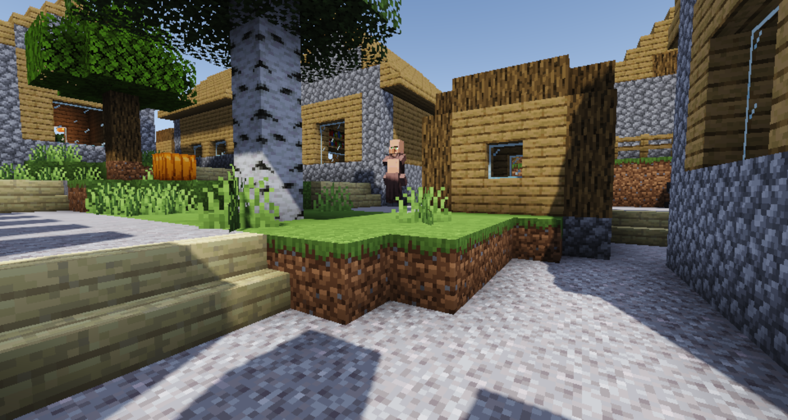
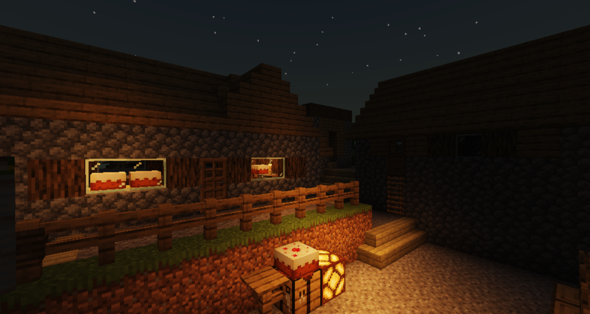
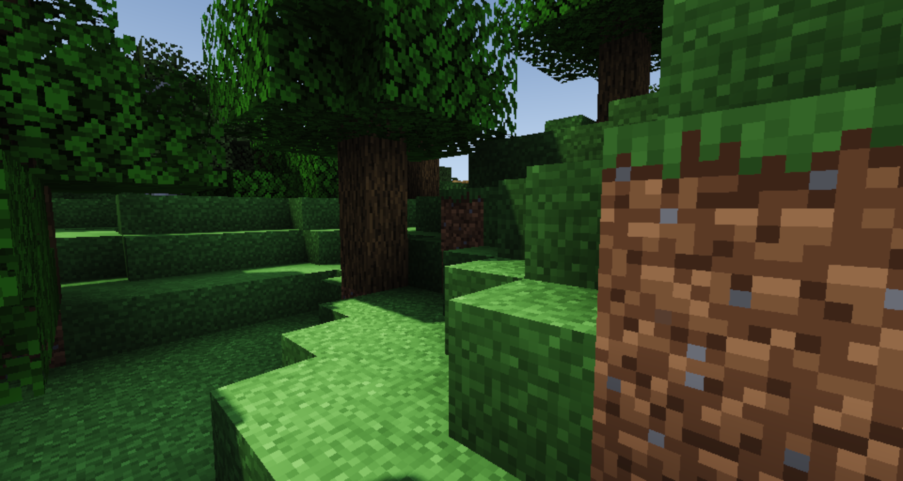
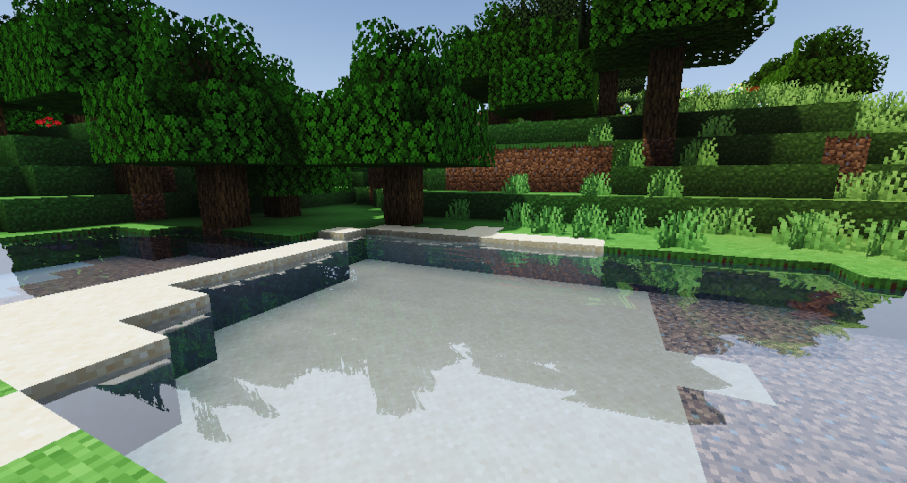

# Overhaul shader
A new and improved shader for Optifine (Iris compatibility coming!). Has decent visuals, including shading, tonemapping, reflections and more!
Download it by clicking the green code button and then selecting "download ZIP". You will have to extract the folder inside the zip into your shaders folder to use the shader.

NOTE: For some reason this gives very good performance. It runs at about 30 to 45 FPS on an Intel iGPU (HD 520 to be specific)

Current functionality includes:
- Optimized, high quality shadows
- Reflections on water
- Colored shadows
- Realistic blocklighting
- Realistic skies
- Refelctions on water
- Time based shadow sharpness
- Basic ambient occlusion

More effects are planned to be included in future updates.

# Screenshots

